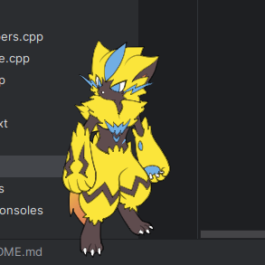

# Desktop Zephyr
This is a fan project for [@AtelierRhyme](https://twitter.com/AtelierRhyme).

This project is an interactive character (AtelierRhyme's original character based on Zeraora) running around your desktop.



<center><i>Zephyr</i></center>

# Features

- Move Zephyr by dragging it around the screen.
- Double-click on it to make it chase your cursor!
- Right-click on it to see additional options in conetxt menu.

# Downloads

You can download prebuilt Linux and Windows binaries from [Releases](https://github.com/NDRAEY/DesktopZephyr/releases) page.

For Windows users: If you downloaded zip file from Releases, unpack it, go to `build` folder and run `DesktopZephyr.exe`.

If you want to build DesktopZephyr yourself, follow the instructions below.

# Build requirements

- Qt 6.0 or newer
- CMake 3.25 or newer
- Clang (> 12) or GCC (not tested yet) compiler

# Build instructions

To download Desktop Zephyr source code, run:
```sh
git clone https://github.com/NDRAEY/DesktopZephyr
cd DesktopZephyr
```

To build DesktopZephyr, run:
```sh
mkdir build
cmake ..
cmake --build .
```

# Credits

- Pictures (sprites): [@AtelierRhyme](https://twitter.com/AtelierRhyme)
- Code: [@THE_NDRAEY](https://twitter.com/THE_NDRAEY)
